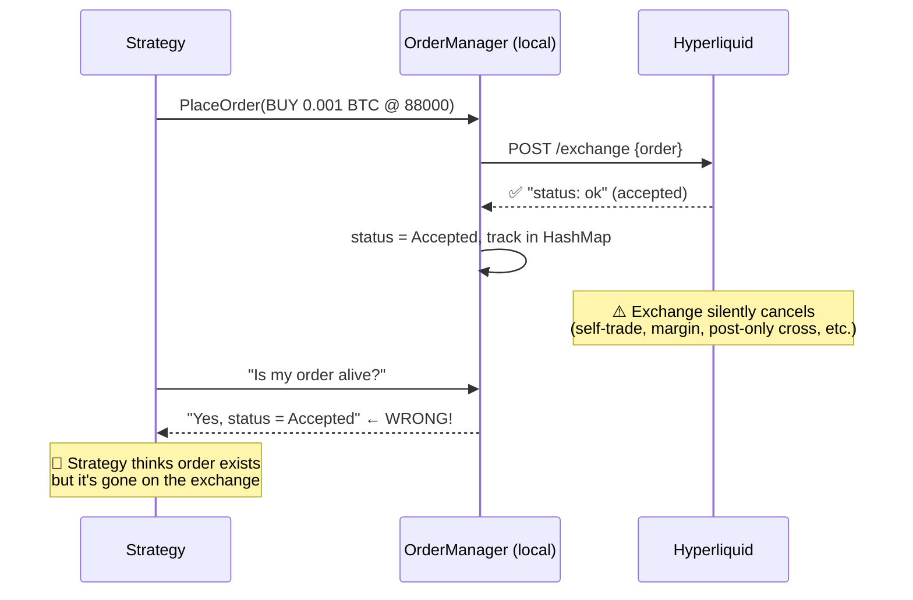
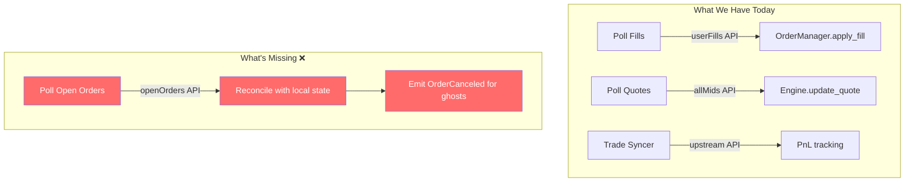
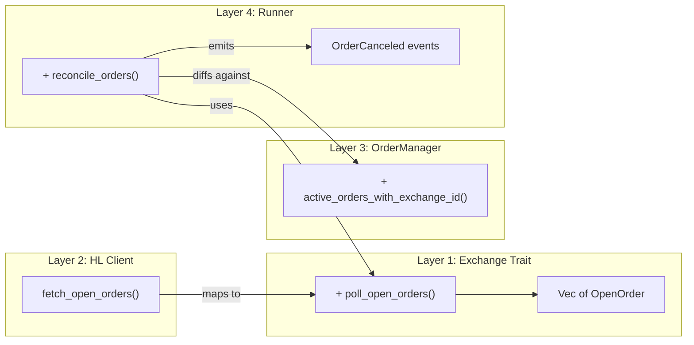

# 🔄 Order Reconciliation: Handling Silently Cancelled Orders

## The Problem



### Why Does This Happen?

| Scenario | What HL Does | Our Current State |
|---|---|---|
| **Post-only crosses** | Accept → immediately cancel | `Accepted` (stale) |
| **Self-trade prevention** | Accept → cancel the resting side | `Accepted` (stale) |
| **Margin insufficiency** | Accept → cancel when margin recalculated | `Accepted` (stale) |
| **Reduce-only becomes invalid** | Accept → cancel | `Accepted` (stale) |

## Current Architecture



### Key Pieces Already In Place

| Component | What It Has | File |
|---|---|---|
| `HyperliquidClient` | `fetch_open_orders()` → `Vec<HyperliquidOrder>` with `oid`, `cloid`, `coin` | [client.rs](file:///Users/amitsharma/Desktop/work/botfromscratch/bot/crates/exchange-hyperliquid/src/client.rs#L492-L509) |
| `OrderManager` | `orders: HashMap<ClientOrderId, LiveOrder>` — all tracked orders | [order_manager.rs](file:///Users/amitsharma/Desktop/work/botfromscratch/bot/crates/bot-engine/src/order_manager.rs#L10-L21) |
| `OrderManager` | `cancel_order()` — marks as `Canceled` + removes from maps | [order_manager.rs](file:///Users/amitsharma/Desktop/work/botfromscratch/bot/crates/bot-engine/src/order_manager.rs#L161-L173) |
| `Exchange` trait | **No `poll_open_orders` method yet** | [exchange.rs](file:///Users/amitsharma/Desktop/work/botfromscratch/bot/crates/bot-core/src/exchange.rs) |
| `HyperliquidOrder` | Has `oid`, `cloid`, `coin`, `side`, `limitPx`, `sz` | [client.rs](file:///Users/amitsharma/Desktop/work/botfromscratch/bot/crates/exchange-hyperliquid/src/client.rs#L40-L51) |

## Proposed Design

### The Reconciliation Algorithm

```
Every N seconds (e.g., 10s via PollGuard):

  1. Fetch exchange open orders → Set<exchange_order_id>
  2. Get local active orders → Set<exchange_order_id>
  3. Ghost orders = local - exchange  (we think alive, exchange says dead)
  4. For each ghost → emit OrderCanceled event → strategy reacts
```

```rust
// Pseudocode for the reconciliation
async fn reconcile_orders(&mut self, exchange: &Arc<dyn Exchange>) {
    let exchange_orders = exchange.poll_open_orders().await;  // NEW trait method
    let exchange_oids: HashSet<ExchangeOrderId> = exchange_orders
        .iter()
        .filter_map(|o| o.exchange_order_id.clone())
        .collect();
    
    // Find ghost orders: locally tracked but missing from exchange
    let local_active: Vec<(ClientOrderId, ExchangeOrderId)> = self.engine
        .order_manager()
        .active_orders_with_exchange_id();  // NEW method
    
    for (client_id, exchange_oid) in local_active {
        if !exchange_oids.contains(&exchange_oid) {
            // Ghost detected! Order was silently cancelled
            tracing::warn!("Ghost order detected: {} (eid={})", client_id, exchange_oid);
            self.engine.order_manager_mut().cancel_order(&client_id);
            
            // Emit event so strategy can react (e.g., replace the order)
            self.handle_event(Event::OrderCanceled(OrderCanceledEvent {
                client_id,
                reason: "exchange_silent_cancel".to_string(),
                ..
            })).await;
        }
    }
}
```

### Changes Needed



#### Layer 1: `Exchange` trait — add `poll_open_orders`

```rust
// bot-core/src/exchange.rs
#[async_trait]
pub trait Exchange: Send + Sync {
    // ... existing methods ...
    
    /// Fetch currently open orders on the exchange.
    /// Used for reconciliation — detecting silently cancelled orders.
    async fn poll_open_orders(&self) -> Result<Vec<OpenOrder>, ExchangeError> {
        Ok(vec![])  // default: no-op for PaperExchange
    }
}

/// Minimal open order representation for reconciliation
pub struct OpenOrder {
    pub exchange_order_id: ExchangeOrderId,
    pub client_id: Option<ClientOrderId>,
    pub instrument: InstrumentId,
}
```

#### Layer 2: `OrderManager` — add `active_orders_with_exchange_id`

```rust
// bot-engine/src/order_manager.rs
pub fn active_orders_with_exchange_id(&self) -> Vec<(ClientOrderId, ExchangeOrderId)> {
    self.orders
        .iter()
        .filter(|(_, o)| matches!(o.status, OrderStatus::Accepted | OrderStatus::PartiallyFilled))
        .filter_map(|(cid, o)| {
            o.exchange_order_id.clone().map(|eid| (cid.clone(), eid))
        })
        .collect()
}
```

#### Layer 3: `Runner` — add reconciliation in the main loop

```rust
// New PollGuard for order reconciliation (slower interval, e.g., 10s)
// Added alongside existing fills_guard and quotes_guard

#[cfg(feature = "native")]  // only for live/paper, not backtest/wasm
if order_reconcile_guard.should_poll() {
    for (instance, exchange) in &exchanges_snapshot {
        self.reconcile_orders(instance, exchange).await;
    }
}
```

## Design Decisions to Consider

### 1. Reconciliation Interval

| Interval | Pros | Cons |
|---|---|---|
| **5s** | Fast ghost detection | More API calls, potential rate limiting |
| **10s** | Good balance | Ghosts live for up to 10s |
| **30s** | Minimal API load | Strategy might place new orders on dead levels |

> **Recommendation**: 10s — aligns with existing sync intervals. Use `PollGuard` like fills/quotes.

### 2. What to Do With Ghost Orders

| Option | Description |
|---|---|
| **A: Just emit `OrderCanceled`** | Let the strategy handle it (most flexible) |
| **B: Auto-resubmit** | Runner resubmits the same order (brittle — what if it was cancelled for a reason?) |
| **C: Emit a new `OrderSilentlyCanceled` event** | Strategy can distinguish intentional vs silent cancels |

> **Recommendation**: Option A or C. Never auto-resubmit — the strategy has context on whether re-placing makes sense.

### 3. Matching Orders: `cloid` vs `oid`

HL's `openOrders` returns both `oid` (exchange ID) and `cloid` (our client ID). Options:

- **Match by `oid`**: Our `exchange_id_map` already maps `ExchangeOrderId → ClientOrderId`. Reliable.
- **Match by `cloid`**: Direct match to `ClientOrderId`. Simpler but `cloid` can be `None` for non-0x prefixed IDs.

> **Recommendation**: Match by `oid` (exchange order ID) since we always track it via `accept_order()`.

### 4. Race Condition: Order Just Placed

```
t=0:  Strategy places order
t=1:  exchange_request() is in-flight
t=2:  Reconciliation runs → order not in openOrders (hasn't been accepted yet!)
t=3:  exchange_request() returns "ok"  → we accept it
```

**Fix**: Only reconcile orders in `Accepted` or `PartiallyFilled` status (skip `New` status). These have already confirmed acceptance from the exchange.

### 5. Rate Limiting

`openOrders` is an Info API call (read-only) — HL's rate limits are quite generous for info requests (~120 req/min). At 10s intervals, that's 6 req/min — very safe.

## Summary Table

| What | Where | Change |
|---|---|---|
| `OpenOrder` struct | `bot-core/exchange.rs` | New type for reconciliation results |
| `poll_open_orders()` | `Exchange` trait | New trait method (default no-op) |
| `poll_open_orders()` impl | `HyperliquidClient` | Maps `fetch_open_orders` → `Vec<OpenOrder>` |
| `active_orders_with_exchange_id()` | `OrderManager` | New query method |
| `reconcile_orders()` | `EngineRunner` | New method in main loop, gated by `PollGuard` |
| Reconciliation guard | `EngineRunner` | New `PollGuard` at ~10s interval |
