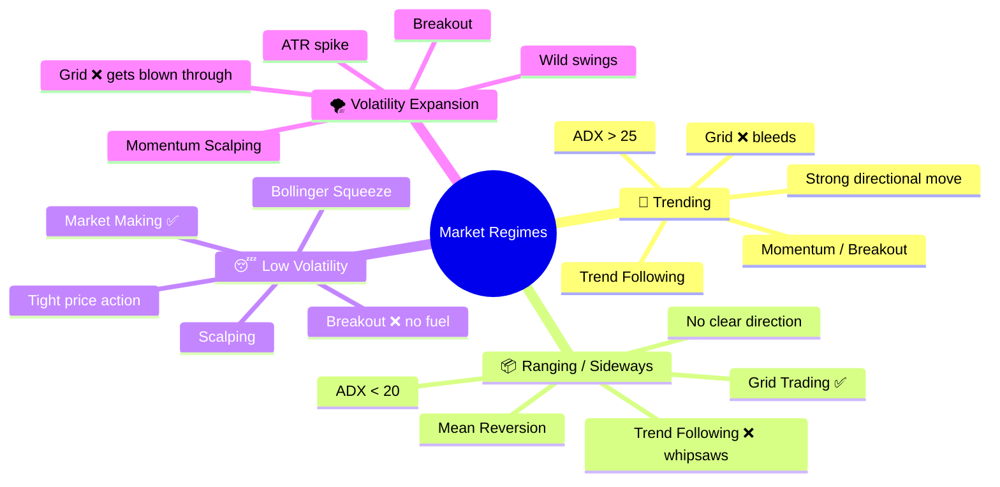
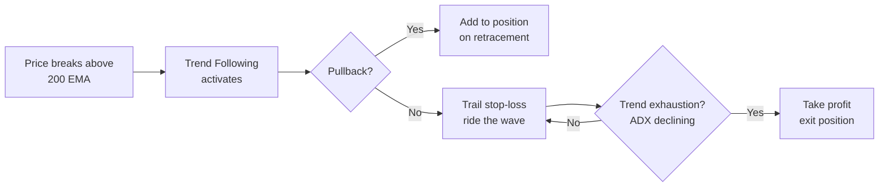
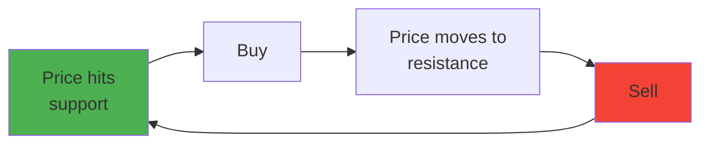
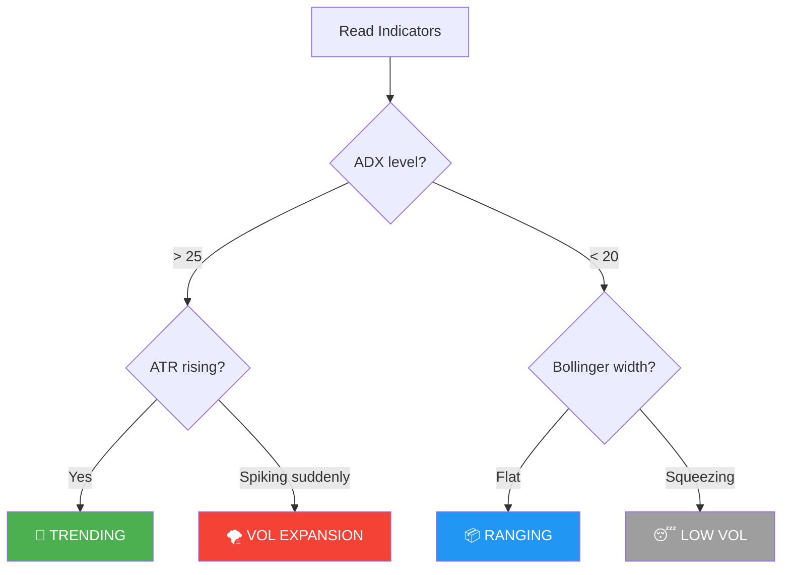
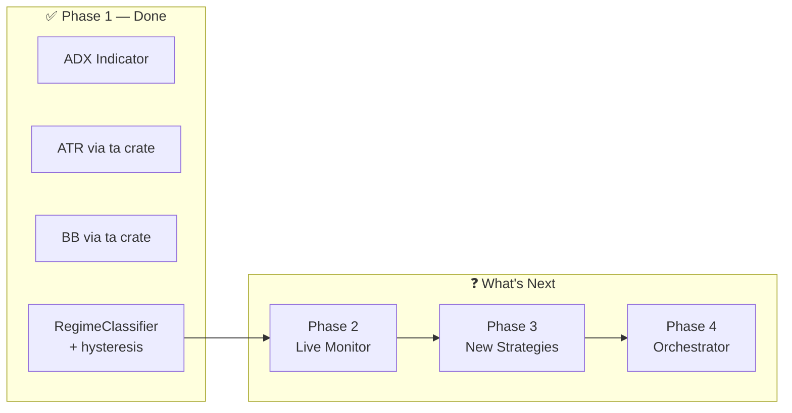
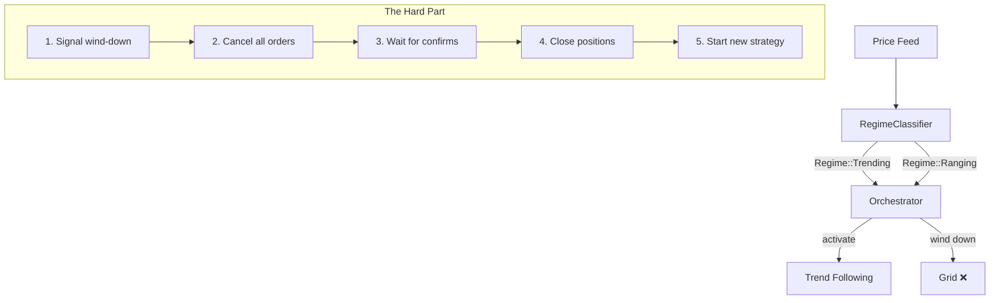
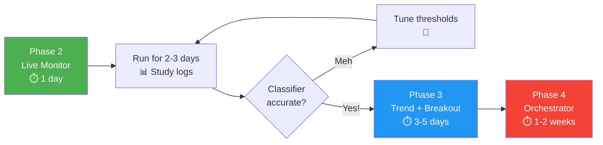

# Trading Strategies by Market Regime

Every market at any given moment falls into one of four regimes. Each regime has strategies that *thrive* in it, strategies that *survive*, and strategies that *bleed*.

---

## The Regime → Strategy Matrix

| Strategy | 🚀 Trending | 📦 Ranging | 😴 Low Vol | 🌪️ Vol Expansion | Core Mechanic |
|----------|:-----------:|:----------:|:----------:|:-----------------:|---------------|
| **Trend Following** | 🟢 Thrives | 🔴 Whipsaws | 🟡 No signal | 🟢 Catches moves | Ride momentum via MA crossover / channel breakout |
| **Grid Trading** | 🔴 One-sided fills | 🟢 Thrives | 🟢 Works | 🔴 Blown through | Place buy/sell ladders, profit from oscillation |
| **Mean Reversion** | 🔴 Gets run over | 🟢 Thrives | 🟢 Works | 🟡 Wide stops | Fade extremes back to mean (RSI, Bollinger bounce) |
| **Market Making** | 🟡 Inventory risk | 🟢 Works | 🟢 Thrives | 🔴 Gets picked off | Post both sides of book, earn spread |
| **Breakout** | 🟢 Catches start | 🔴 False breakouts | 🟢 Catches squeeze | 🟢 Thrives | Enter on range/level break with volume |
| **Momentum Scalping** | 🟢 Thrives | 🔴 No momentum | 🔴 No fuel | 🟢 Thrives | Quick entries on strong moves, tight exits |
| **DCA (Dollar-Cost Avg)** | 🟡 OK for entries | 🟢 Accumulates well | 🟢 Low cost basis | 🟡 High variance | Systematic fixed-interval entries |
| **Arbitrage** | 🟡 Spread tightens | 🟢 Stable spreads | 🟢 Predictable | 🟢 Spreads widen | Exploit price differences across venues |
| **Statistical Arb** | 🟡 Pairs diverge | 🟢 Stable correlation | 🟢 Mean reverts | 🔴 Correlation breaks | Trade correlated pairs when spread deviates |
| **Volatility Selling** | 🔴 Gets crushed | 🟢 Collects premium | 🟢 Thrives | 🔴 Blown up | Sell options/vol when realized < implied |

> 🟢 = Strategy's sweet spot &nbsp;&nbsp; 🟡 = Survives with adjustments &nbsp;&nbsp; 🔴 = Actively loses money

---

## Strategy Deep-Dives by Regime

### 🚀 Trending Market
> *"The trend is your friend until it bends."*

Price moves decisively in one direction. ADX > 25, price above/below key moving averages.

| Strategy | How It Works in Trend | Key Indicator |
|----------|----------------------|---------------|
| **Trend Following** | Enter on MA crossover, ride with trailing stop | EMA 20/50 cross, ADX > 25 |
| **Momentum** | Enter on strong candles, exit on momentum fade | RSI divergence, Volume spike |
| **Breakout** | Enter when price breaks consolidation | Volume + price level break |

> [!CAUTION]
> **Grid and Mean Reversion bleed here** — Grid gets one-sided fills (all buys fill, no sells, or vice versa). Mean reversion keeps fading a move that doesn't stop.

---

### 📦 Ranging / Sideways Market
> *"Chop is the graveyard of trend followers."*

Price oscillates between support and resistance. ADX < 20, Bollinger bands are flat.

| Strategy | How It Works in Range | Key Indicator |
|----------|----------------------|---------------|
| **Grid Trading** | Ladder of buy/sell orders across the range | Price bounds + grid spacing |
| **Mean Reversion** | Buy oversold, sell overbought | RSI < 30 → buy, RSI > 70 → sell |
| **Market Making** | Post bids and asks, earn the spread | Tight spreads, low ADX |
| **Statistical Arb** | Trade mean-reverting pairs | Correlation + z-score of spread |

> [!TIP]
> This is Grid's **home turf**. The key is identifying the range boundaries correctly. Bollinger Bands + horizontal S/R levels are your best friends.

---

### 😴 Low Volatility
> *"Calm before the storm."*

Tight consolidation, Bollinger squeeze, ATR at multi-period lows.

| Strategy | How It Works in Low Vol | Key Indicator |
|----------|------------------------|---------------|
| **Market Making** | Tight spreads = safe to post both sides | Bollinger width < threshold |
| **Breakout (Anticipatory)** | Position small for the eventual squeeze breakout | Bollinger squeeze detection |
| **Grid (Tight)** | Very tight grid captures micro-oscillations | ATR for grid spacing |

> [!IMPORTANT]
> Low vol **always** ends. The question is *when* and *which direction*. Market making thrives here but must have a kill switch for when vol explodes.

---

### 🌪️ Volatility Expansion
> *"When others panic, breakout traders feast."*

ATR spikes, Bollinger bands widen violently, large candles.

| Strategy | How It Works in Vol Expansion | Key Indicator |
|----------|-------------------------------|---------------|
| **Breakout** | Price breaks out of squeeze with momentum | Volume + ATR spike |
| **Momentum Scalping** | Quick entries on strong impulse moves | Candle size + volume |
| **Arbitrage** | Spreads widen across exchanges = bigger edge | Cross-exchange price diff |

> [!CAUTION]
> **Grid, Market Making, and Vol Selling get destroyed here.** Grid gets blown through all levels. Market makers get adversely selected. Vol sellers face unlimited risk as realized vol explodes past implied.

---

## Regime Detection Cheat Sheet

How to know which regime you're in:

| Indicator | Trending | Ranging | Low Vol | Vol Expansion |
|-----------|----------|---------|---------|---------------|
| **ADX** | > 25 (strong) | < 20 (weak) | < 15 | > 30 (spiking) |
| **Bollinger Width** | Expanding | Flat | Squeezing | Exploding |
| **ATR** | Rising | Flat/Low | At lows | Spiking |
| **Price vs MA** | Separated | Oscillating around | Hugging | Far away |
| **Volume** | High | Low/Normal | Low | Very High |

---

## Mapping to Supurr Bot

| Regime | Best Strategy | Supurr Status | Priority |
|--------|--------------|---------------|----------|
| 📦 Ranging | Grid | ✅ Built | — |
| 📦 Ranging | Mean Reversion (RSI) | ✅ Built | — |
| 😴 Low Vol | Market Maker | ✅ Built | — |
| 🚀 Trending | Trend Following | ❌ Missing | Phase 3 |
| 🌪️ Vol Expansion | Breakout | ❌ Missing | Phase 3 |
| *All* | Regime Classifier | ❌ Missing | Phase 2 |
| *All* | SharpeGuard Orchestrator | ❌ Missing | Phase 4 |
# Regime Classifier — What's Next?

> Phase 1 ✅ complete (indicators + classifier + 27 tests). Now what?

## Where We Are

---

## 3 Paths Forward

### Path A: 🔭 **Live Regime Monitor** (Phase 2)
> *"See what the classifier actually says about real markets before trusting it with money."*

Build `RegimeMonitorStrategy` — a thin strategy that:
- Subscribes to price feed
- Builds bars via existing `BarBuilder`
- Feeds bars into `RegimeClassifier`
- **Logs** the detected regime (no trading)
- Optionally emits metrics for dashboard

| Effort | Risk | Value |
|--------|------|-------|
| Small (~1 day) | Zero (no trading) | **Huge** — validates the classifier on real data |

> [!TIP]
> This is the "trust but verify" step. You'd run it alongside the grid bot for a few days, watching logs to see if regime changes match reality.

**Key decisions:**
1. Bar duration? (5min? 1min? 15s?)
2. Pre-seed percentile history from candle API on startup? (avoids 8hr warmup)
3. Log to where? (stdout? structured JSON? DB for later analysis?)

---

### Path B: 🏗️ **Build Missing Strategies** (Phase 3)
> *"The classifier is useless if we don't have strategies to switch between."*

Currently have:

| Regime | Strategy | Status |
|--------|----------|--------|
| 📦 Ranging | Grid | ✅ Built |
| 📦 Ranging | RSI Mean Reversion | ✅ Built |
| 😴 Low Vol | Market Maker | ✅ Built |
| 🚀 Trending | Trend Following | ❌ **Missing** |
| 🌪️ Vol Expansion | Breakout | ❌ **Missing** |

Two strategies needed:

#### 1. Trend Following Strategy
- **Core**: EMA crossover (20/50) or channel breakout
- **Entry**: Price crosses above/below EMA with ADX > 25
- **Exit**: Trail stop at 2× ATR, or ADX drops below 20
- **Position sizing**: Scale with ADX strength
- **Complexity**: Medium — similar to RSI in structure

#### 2. Breakout Strategy
- **Core**: Enter when price breaks out of a BB squeeze
- **Entry**: Close crosses upper/lower band after BB width was in bottom 20%
- **Exit**: Trail stop, or when ATR normalizes
- **Complexity**: Medium-High — needs squeeze detection (we already have this!)

> [!IMPORTANT]
> These strategies can be built **independently** of the orchestrator. They're just normal strategies that happen to work well in specific regimes.

---

### Path C: 🎛️ **SharpeGuard Orchestrator** (Phase 4)
> *"The brain that decides which strategy runs when."*

**This is the hardest part.** Hot-swapping strategies with open orders is non-trivial:
- Grid has a ladder of open orders — can't just kill them
- Position might be open — need graceful close
- Race conditions between cancel and fill
- What if regime flips back during wind-down?

| Effort | Risk | Value |
|--------|------|-------|
| Large (1-2 weeks) | High (money at stake) | **Maximum** — the whole point |

---

## Recommended Order

> [!CAUTION]
> **Don't skip Phase 2.** The classifier's thresholds (ADX > 25, ATR 90th percentile, etc.) are textbook defaults. Real markets for your specific instruments might need very different numbers. The monitor phase reveals this.

---

## Wild Ideas 🧠

- **Backtesting harness**: Feed historical candle data through the classifier, visualize regime changes on a chart
- **Regime persistence scoring**: Track how long each regime lasts — helps with confirmation_bars tuning
- **Multi-timeframe regimes**: Run classifier on 1min AND 15min bars, only trade when both agree
- **Regime-aware grid**: Instead of full orchestrator, just adjust grid spacing based on regime (tighter in LowVol, wider in VolExpansion, pause in Trending)
- **WebSocket regime feed**: Stream regime changes to the frontend dashboard in real-time
